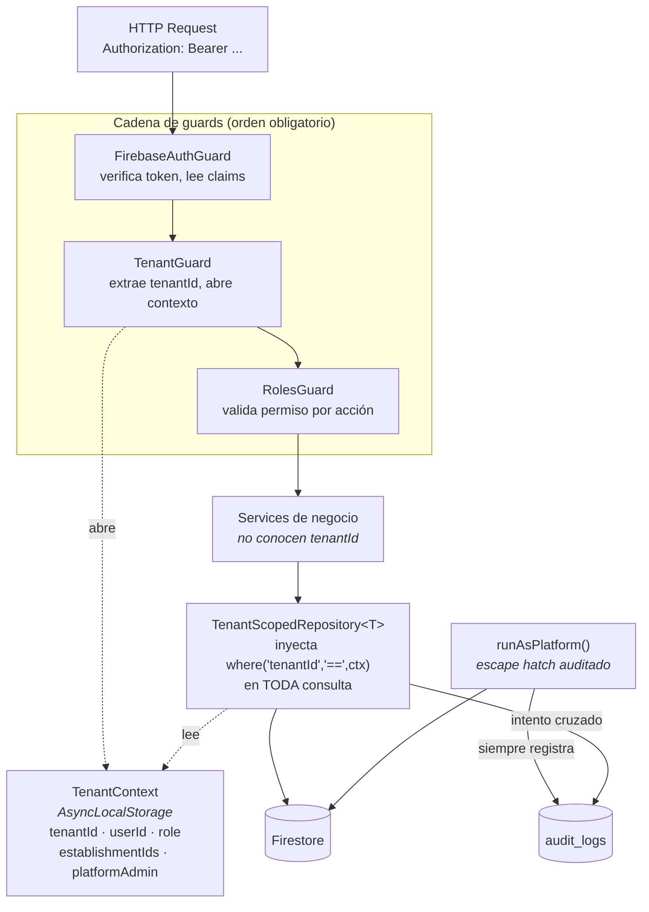

# 01 — Multi-tenancy

**Fase:** 1 · **Requisitos:** REQ-001, REQ-004, REQ-020 · **Cobertura mínima:** 90%

Aislar los datos de cada concesionario dentro de una base Firestore compartida, de modo que
sea imposible —no improbable— que una consulta devuelva datos de otro tenant.

---

## 1. Problema

Hoy los servicios consultan Firestore directamente:

```typescript
// vehicles.service.ts — patrón actual, repetido 165 veces
const snapshot = await this.firebase
  .firestore()
  .collection('vehicles')
  .where('sede', '==', user.sede)
  .get();
```

El filtro por `sede` se aplica a mano. En unos lugares sale de `user.sede`, en otros de un query
param que el cliente controla. Ese es exactamente el fallo que no podemos permitirnos con
`tenantId`: si el aislamiento depende de que cada desarrollador se acuerde de escribir un `where`,
el aislamiento no existe.

---

## 2. C4 Nivel 3 — Camino de una request



**Regla de lectura del diagrama:** los services no reciben ni pasan `tenantId`. Si un service
tiene un parámetro `tenantId`, el diseño está mal: significa que alguien puede pasarle uno
distinto al del token.

---

## 3. Decisiones de diseño

### D-101 — `AsyncLocalStorage` en vez de providers request-scoped

NestJS ofrece providers con `scope: Scope.REQUEST`, pero contaminan: cualquier servicio que
inyecte uno se vuelve request-scoped también, y Nest reconstruye ese subárbol de inyección de
dependencias en cada request. Con 14 módulos interconectados el costo es real.

`AsyncLocalStorage` (nativo de Node, o `nestjs-cls`) transporta el contexto a través de la cadena
de llamadas asíncronas sin tocar el contenedor de DI.

```typescript
// common/tenant/tenant-context.ts
import { AsyncLocalStorage } from 'node:async_hooks';

export interface TenantContextData {
  tenantId: string;
  userId: string;
  role: RoleEnum;
  establishmentIds: string[];
  platformAdmin: boolean;
  requestId: string;
}

const storage = new AsyncLocalStorage<TenantContextData>();

export const TenantContext = {
  run<T>(data: TenantContextData, fn: () => T): T {
    return storage.run(data, fn);
  },

  get(): TenantContextData | undefined {
    return storage.getStore();
  },

  getOrThrow(): TenantContextData {
    const ctx = storage.getStore();
    if (!ctx) {
      throw new InternalServerErrorException(
        'Consulta ejecutada fuera de un contexto de tenant',
      );
    }
    return ctx;
  },
};
```

`getOrThrow` es el mecanismo de fallo cerrado: una consulta fuera de contexto revienta en vez
de devolver datos de todos los tenants.

### D-102 — El `tenantId` sale del token y solo del token

> **Corrección aplicada durante la implementación.** El diseño original proponía abrir el
> contexto en un middleware. No funciona: en NestJS **el middleware corre antes que los
> guards**, así que `req.user` todavía no existe cuando el middleware se ejecuta — lo puebla
> `FirebaseAuthGuard`. La implementación real usa un **interceptor**
> (`TenantContextInterceptor`), que corre después de los guards y sí envuelve la ejecución del
> handler. La suscripción a `next.handle()` se hace dentro de `TenantContext.run()`, porque
> `next.handle()` construye el Observable pero el handler solo se ejecuta al suscribirse.

```typescript
// common/guards/tenant.guard.ts
@Injectable()
export class TenantGuard implements CanActivate {
  async canActivate(context: ExecutionContext): Promise<boolean> {
    const req = context.switchToHttp().getRequest();
    const user = req.user as AuthenticatedUser;

    if (!user?.tenantId) {
      throw new UnauthorizedException('Token sin tenant asignado');
    }

    const tenant = await this.tenants.findById(user.tenantId);
    if (!tenant || tenant.status !== 'ACTIVE') {
      throw new ForbiddenException('Concesionario inactivo o inexistente');
    }

    return new Promise((resolve, reject) => {
      TenantContext.run(
        {
          tenantId: user.tenantId,
          userId: user.uid,
          role: user.role,
          establishmentIds: user.establishmentIds ?? [],
          platformAdmin: user.platformAdmin === true,
          requestId: req.headers['x-request-id'] ?? randomUUID(),
        },
        () => next(context).then(resolve).catch(reject),
      );
    });
  }
}
```

> **Nota de implementación:** un `CanActivate` no envuelve la ejecución del handler. Para que el
> contexto siga vivo durante todo el request, `TenantContext.run` debe abrirse en un
> **middleware** o en un interceptor, no en el guard. El guard valida; el middleware abre el
> contexto. Se implementa como `TenantContextMiddleware` aplicado globalmente en `AppModule`,
> ejecutado después de la autenticación.

### D-103 — El repositorio como único acceso a Firestore

```typescript
// common/repositories/tenant-scoped.repository.ts
export abstract class TenantScopedRepository<T extends { tenantId: string }> {
  protected abstract readonly collectionName: string;

  constructor(protected readonly firebase: FirebaseService) {}

  /** Consulta base: SIEMPRE con el filtro de tenant aplicado. */
  protected scopedQuery(): FirebaseFirestore.Query {
    const ctx = TenantContext.getOrThrow();
    return this.firebase
      .rawFirestore()
      .collection(this.collectionName)
      .where('tenantId', '==', ctx.tenantId);
  }

  async create(data: Omit<T, 'tenantId' | 'id'>): Promise<T> {
    const ctx = TenantContext.getOrThrow();
    // El tenantId del contexto pisa cualquier valor del payload — REQ-004
    const payload = { ...data, tenantId: ctx.tenantId };
    const ref = await this.firebase
      .rawFirestore()
      .collection(this.collectionName)
      .add(payload);
    return { id: ref.id, ...payload } as T;
  }

  async findById(id: string): Promise<T | null> {
    const ctx = TenantContext.getOrThrow();
    const doc = await this.firebase
      .rawFirestore()
      .collection(this.collectionName)
      .doc(id)
      .get();

    if (!doc.exists) return null;

    const data = doc.data() as T;
    if (data.tenantId !== ctx.tenantId) {
      // Acceso cruzado: se audita con el tenantId REAL del token — REQ-001
      await this.audit.recordCrossTenantAttempt({
        collection: this.collectionName,
        documentId: id,
        ownerTenantId: data.tenantId,
      });
      return null; // Ver D-104
    }
    return data;
  }
}
```

### D-104 — Acceso cruzado devuelve 404, nunca 403 {#d-104}

El escenario Gherkin original admitía «403 o 404». **Se cierra a 404.**

Un 403 responde «existe, pero no podés verlo». Eso permite enumerar: un atacante prueba IDs y
distingue los que existen en otro concesionario de los que no existen en ninguno. Con eso puede
inferir volumen de inventario de la competencia, que en este mercado es información comercial
sensible.

Un 404 es indistinguible de «no existe». Es la única respuesta que no filtra información.

### D-105 — Enforcement: hacer imposible el bypass

Tres capas, ninguna basada en revisión de código:

1. **Renombrar el acceso crudo.** `FirebaseService.firestore()` pasa a llamarse `rawFirestore()`.
   El nombre es deliberadamente incómodo y hace que cualquier uso salte en un diff.

2. **Regla de ESLint que bloquea el build.**

   ```javascript
   // eslint.config.mjs
   {
     files: ['src/modules/**/*.ts'],
     ignores: [
       'src/**/repositories/**',
       'src/modules/seed/**',
       'src/modules/tenant-provisioning/**',
     ],
     rules: {
       'no-restricted-syntax': [
         'error',
         {
           selector: "CallExpression[callee.property.name='rawFirestore']",
           message:
             'Acceso directo a Firestore prohibido fuera de la capa de repositorios. ' +
             'Usá un TenantScopedRepository. Si necesitás cruzar tenants, usá runAsPlatform().',
         },
       ],
     },
   }
   ```

3. **Fallo en tiempo de ejecución.** `getOrThrow()` revienta si no hay contexto. Un repositorio
   instanciado fuera de una request no consulta: lanza excepción.

### D-106 — Escape hatch explícito y auditado

Hay operaciones que legítimamente cruzan tenants: provisionar un concesionario nuevo, ejecutar
una migración, soporte de plataforma. Sin una puerta oficial, alguien va a saltear el repositorio
«solo esta vez» y esa excepción se vuelve permanente.

```typescript
// common/tenant/run-as-platform.ts
export async function runAsPlatform<T>(
  reason: string,
  audit: AuditService,
  fn: () => Promise<T>,
): Promise<T> {
  const ctx = TenantContext.get();
  if (!ctx?.platformAdmin) {
    throw new ForbiddenException('Operación restringida a administradores de plataforma');
  }
  await audit.append({
    action: 'PLATFORM_SCOPE_ESCALATION',
    entity: 'platform',
    metadata: { reason },
  });
  return fn();
}
```

El `reason` es obligatorio y queda en `audit_logs`. La función está en la lista de excepciones
de ESLint solo para tres directorios.

### D-107 — Muerte de `SedeEnum`

`SedeEnum` es un enum con valores fijos (`SURMOTOR`, `GRANDA_CENTENO`, …) que hoy vive en el
custom claim de Firebase, en DTOs, en validadores y en el mapeo de agencias del ETL. Cada
concesionario tiene sus propias sucursales: el enum no puede sobrevivir a multi-tenancy.

| Antes | Después |
|---|---|
| `sede: SedeEnum` en el claim | `establishmentIds: string[]` en el claim |
| Enum en `common/enums/sede.enum.ts` | Documentos en `tenants/{id}/establishments/{estId}` |
| `where('sede','==',user.sede)` | `where('establishmentId','in',ctx.establishmentIds)` |
| Mapeo `MAT → SURMOTOR` hardcodeado en el ETL | Config de mapeo por tenant |

El cambio a `establishmentIds` como arreglo resuelve además el caso de usuarios multi-sede,
que hoy se maneja con ramas especiales en `home.service.ts`.

**Advertencia sobre `in`:** Firestore limita el operador `in` a 30 valores. Un grupo grande con
más de 30 sucursales necesita partición de consulta. Se documenta como límite conocido y se
valida en el provisioning: más de 30 establecimientos por usuario requiere revisión.

#### Consultas que filtran por `sede` y hay que migrar todas juntas

`sede` no vive en un solo lugar. Al ejecutar D-107 hay que tocar **todas** estas consultas en el
mismo cambio; olvidar una no rompe el build ni ningún test — simplemente devuelve resultados
vacíos en silencio.

| Consulta | Archivo | Qué se rompe si se olvida |
|---|---|---|
| Destinatarios de notificaciones por rol y sede | `notifications/notification-recipients.repository.ts` | Las notificaciones dejan de llegar, sin error visible |
| Listado de usuarios por sede | `users/users.repository.ts` | El admin muestra listas vacías |
| Listado y KPIs de vehículos por sede | `vehicles/vehicles.service.ts` | Stock vacío por sucursal |
| Agenda por sede | `appointments/appointments.service.ts` | Calendario vacío |
| Órdenes de trabajo por sede | `service-orders/service-orders.service.ts` | Taller sin OTs |

**Sobre la duplicación users/notifications:** `NotificationRecipientsRepository` y
`UsersRepository` consultan la misma colección `users`. Es deliberado y ambos extienden
`TenantScopedRepository`, así que el aislamiento está garantizado en los dos. Se mantienen
separados porque `UsersService.findAll()` oculta `fcmTokens` a propósito y consolidarlos
obligaría a exponerlos en el servicio de usuarios, además de crear una dependencia
`notifications → users` que hoy no existe. El costo de la duplicación es este renglón de la
tabla de arriba.

---

## 4. Modelo de datos

```
tenants/{tenantId}
  ├─ name, ruc, plan, status, createdAt
  ├─ branding/            { logoUrl, primaryColor, displayName }
  ├─ establishments/{id}  { code, name, address, active }
  └─ settings/
       ├─ milestone-map        → ver documento 04
       ├─ import-mappings      → ver documento 03
       └─ certification-checklist

vehicles/{id}          { tenantId, establishmentId, ... }
documentations/{id}    { tenantId, vehicleId, ... }
service_orders/{id}    { tenantId, ... }
appointments/{id}      { tenantId, ... }
delivery_ceremonies/{id} { tenantId, ... }
users/{uid}            { tenantId, role, establishmentIds[] }
audit_logs/{id}        { tenantId, ... }   ← append-only, ver documento 02
```

**Índices:** los 80 renglones de `firestore.indexes.json` se regeneran con `tenantId` como
**primer campo** de todo índice compuesto. Firestore exige que los campos de igualdad precedan
a los de rango y ordenamiento; poner `tenantId` primero es obligatorio, no una optimización.

---

## 5. Migración del concesionario actual

Script idempotente, ejecutable en seco, en cinco pasos ordenados:

| Paso | Acción | Verificación |
|---|---|---|
| 1 | Crear documento `tenants/kia-ecuador` y sus `establishments` desde los valores de `SedeEnum` | Conteo de establecimientos = valores del enum |
| 2 | Añadir `tenantId` a todos los documentos de todas las colecciones (lotes de 500) | Conteo antes = conteo después, con `tenantId` presente en 100% |
| 3 | Mapear `sede: string` → `establishmentId` en cada documento | Ningún documento con `sede` sin `establishmentId` |
| 4 | **Re-emitir custom claims de todos los usuarios** con `tenantId` y `establishmentIds` | Todos los usuarios pueden autenticarse tras el cambio |
| 5 | Desplegar índices nuevos y esperar construcción **antes** de activar `TenantGuard` | Consola de Firebase: índices en estado *Enabled* |

**El paso 4 es el que hunde el despliegue si se olvida.** El plan original solo mencionaba
asignar `tenantId` a las colecciones. Los claims viven en Firebase Auth, no en Firestore: si
no se re-emiten, el `TenantGuard` rechaza a todos los usuarios el día del despliegue y el
sistema queda inaccesible hasta que alguien lo note.

El orden 5 → activación también importa: activar el guard antes de que los índices estén
construidos produce errores `FAILED_PRECONDITION` en cada consulta.

---

## 6. Estrategia de pruebas

### Unitarios — 90% mínimo

| Caso | Qué verifica |
|---|---|
| `scopedQuery()` sin contexto | Lanza excepción, no consulta |
| `create()` con `tenantId` ajeno en el payload | El del contexto prevalece — REQ-004 |
| `findById()` de documento de otro tenant | Devuelve `null` y registra intento |
| `findById()` de documento inexistente | Devuelve `null` sin registrar intento |
| `runAsPlatform()` sin claim de plataforma | Lanza `ForbiddenException` |
| `runAsPlatform()` con claim | Ejecuta y registra en auditoría con el motivo |
| `TenantContext.run()` anidado | El contexto interno no filtra al externo |

### Integración — emulador de Firestore

| Caso | Qué verifica |
|---|---|
| Dos tenants con datos sembrados; consulta de listado | Solo devuelve los del tenant del contexto |
| Consulta paginada por cursor con dos tenants | El cursor no salta a documentos del otro tenant |
| Consulta con `orderBy` sobre índice compuesto | El índice con `tenantId` primero existe y funciona |
| Reglas de Firestore desde el SDK cliente | Todo acceso directo rechazado (`@firebase/rules-unit-testing`) |

### BDD — `backend/features/aislamiento-tenant.feature`

Cubre REQ-001, REQ-004 y REQ-020. Corre en cada pull request, sin excepción.

### Prueba de regresión permanente

Un test que **cuenta las violaciones de la regla de ESLint** y falla si el número sube respecto
a la línea base. Impide que se agreguen excepciones nuevas al enforcement sin decisión explícita.
