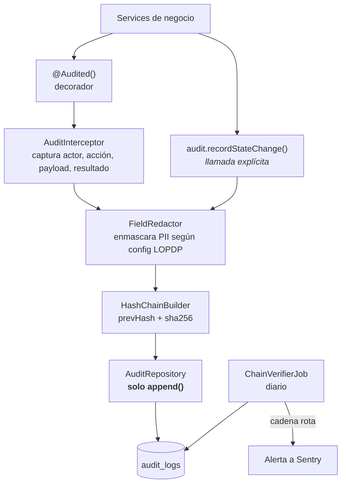

# 02 — Auditoría inmutable

**Fase:** 1 · **Requisitos:** REQ-002 · **Cobertura mínima:** 85%

Registro append-only de toda mutación de negocio. Es el sustento técnico del argumento de venta
de trazabilidad y la fuente de datos del timeline del vehículo y de los relojes de SLA.

---

## 1. Corrección al plan original

> El plan decía: *«Colección `audit_logs` append-only (reglas: create sí, update/delete nunca,
> ni siquiera desde Admin SDK en código de negocio)»*.

**Las reglas de seguridad de Firestore no se aplican al Admin SDK.** El Admin SDK las ignora
por completo, por diseño: se autentica con una cuenta de servicio y opera con privilegios
totales. Escribir `allow update, delete: if false` en las reglas no impide absolutamente nada
a un backend que usa Admin SDK, que es exactamente lo que hace este sistema.

Si el argumento de venta es «trazabilidad inmutable» y la inmutabilidad descansa sobre reglas
que el propio backend ignora, el argumento es falso. Un auditor competente lo detecta en una
pregunta.

### D-201 — Inmutabilidad detectable, no inmutabilidad imposible {#d-201}

Con Admin SDK no se puede hacer imposible el borrado. Se puede hacer **detectable**, que es lo
que un auditor acepta y lo que la ley pide.

| Capa | Mecanismo | Qué garantiza |
|---|---|---|
| Arquitectura | `AuditRepository` expone únicamente `append()`. No existe método de update ni delete | Nadie modifica auditoría por accidente |
| Lint en CI | Prohibida toda referencia a `audit_logs` fuera de `AuditModule` | Nadie inventa un acceso paralelo |
| Cadena de hash | Cada entrada guarda `prevHash` y `hash = sha256(prevHash ‖ canonical(entrada))` | Toda alteración o borrado rompe la cadena y es demostrable |
| Verificación programada | Job diario que recorre la cadena y alerta si se rompe | La detección es activa, no reactiva |
| Endurecimiento enterprise *(opcional)* | Cuenta de servicio separada con IAM append-only, o proyecto GCP dedicado | Inmutabilidad real, a costa de complejidad operativa |

La cadena de hash es la pieza que convierte «confiá en nosotros» en «verificalo vos mismo».
Un concesionario puede exportar sus `audit_logs`, recalcular la cadena y comprobar que nadie
tocó nada. Eso es vendible; una regla de Firestore que el backend ignora, no.

---

## 2. C4 Nivel 3 — Componentes



---

## 3. Decisiones de diseño

### D-202 — Híbrido: decorador para lo grueso, llamada explícita para lo crítico

Un interceptor genérico no puede conocer el estado *anterior* de una entidad sin leerla, y leer
antes de cada mutación duplica el costo de Firestore. La solución no es elegir una técnica sino
separar dos necesidades distintas:

- **`@Audited()`** en el controlador: registra quién llamó a qué, con qué payload y con qué
  resultado. Barato, automático, cubre el 100% de las mutaciones.
- **`audit.recordStateChange()`** explícito en los services que cambian estado de vehículo,
  orden de trabajo o entrega. Ahí sí importa el `before`/`after` y el service ya tiene el
  documento anterior en memoria porque lo necesitó para validar la transición.

El segundo grupo es el corazón del producto: es lo que alimenta el timeline y los relojes de SLA.

### D-203 — Redacción de PII antes de persistir

`before` y `after` de una documentación contienen cédula, teléfono y dirección del cliente
final. Guardar eso en un log con retención de siete años crea una obligación bajo la LOPDP
que nadie pidió.

```typescript
// audit/field-redactor.ts
const DEFAULT_REDACTED = ['cedula', 'telefono', 'email', 'direccion'];

// Se guarda un hash del valor, no el valor:
//   "cedula": { redacted: true, fingerprint: "sha256:a3f9..." }
```

El *fingerprint* permite responder «¿cambió este campo?» sin almacenar el dato. Cuando un
cliente ejerce derecho de supresión, se borra el dato de la colección de negocio y la auditoría
sigue siendo verificable porque nunca lo tuvo.

### D-204 — Estructura de la entrada

> **Hallazgo de la capa de integración.** Firestore **rechaza `undefined` como valor**. Escribir
> `before`/`after`/`metadata` sin definir hacía fallar la escritura real, aunque el mock de los
> tests unitarios lo aceptara sin chistar. La implementación omite esas claves en vez de
> escribirlas como `undefined`; `canonicalize` ya ignora las claves undefined, así que omitirlas
> no altera el hash. Es exactamente el tipo de defecto que solo aparece contra la base real —
> justificación concreta de por qué la capa de integración de la pirámide no es opcional.

```typescript
interface AuditEntry {
  tenantId: string;
  actorUid: string;
  actorRole: RoleEnum;
  action: string;              // VEHICLE_STATUS_CHANGED, DOCUMENT_UPLOADED, ...
  entity: string;              // vehicles, service_orders, ...
  entityId: string;
  before?: Record<string, unknown>;   // redactado
  after?: Record<string, unknown>;    // redactado
  at: Timestamp;
  ip: string;
  userAgent: string;
  requestId: string;
  prevHash: string;
  hash: string;
}
```

`requestId` permite correlacionar todas las entradas de una misma operación, incluyendo las de
otros módulos. Sale del `TenantContext`.

### D-205 — Concurrencia en la cadena de hash

Una cadena de hash es secuencial por definición y el backend es concurrente. Dos escrituras
simultáneas leyendo el mismo `prevHash` producen una bifurcación.

**Decisión:** la cadena es **por tenant**, no global, y el avance del puntero se hace en una
transacción de Firestore sobre `tenants/{id}/audit-head`. Esto acota la contención al volumen
de un solo concesionario, que en el peor caso realista son unidades de escrituras por segundo.

Si el volumen creciera, la alternativa es cadena por tenant y por día: se rompe la continuidad
entre días pero se conserva la detección dentro de cada uno, y se paraleliza. No se implementa
ahora — se documenta como salida conocida.

### D-206 — Retención de siete años

Alineado con requisitos tributarios ecuatorianos. Firestore no es el lugar para almacenar siete
años de logs: es caro y las consultas se degradan.

- **0 a 12 meses:** en Firestore, consultable desde el admin.
- **12+ meses:** exportado a Cloud Storage en formato NDJSON comprimido, con la cadena de hash
  intacta para verificación posterior. Política de ciclo de vida a *Nearline* y luego *Coldline*.

El job de archivado corre mensualmente y también es una operación auditada.

---

## 4. Estrategia de pruebas

### Unitarios — 85% mínimo

| Caso | Qué verifica |
|---|---|
| `append()` calcula `hash` con `prevHash` correcto | Encadenamiento |
| Primera entrada de un tenant | `prevHash` es el valor génesis, no `undefined` |
| `FieldRedactor` con campos PII | Sustituye por fingerprint; no deja el valor |
| `FieldRedactor` con campos no sensibles | Los deja intactos |
| `ChainVerifier` sobre cadena íntegra | Reporta válida |
| `ChainVerifier` con una entrada alterada | Identifica la posición exacta de la ruptura |
| `ChainVerifier` con una entrada eliminada | Detecta la discontinuidad |
| `AuditRepository` | No expone métodos de update ni delete *(verificación de superficie de API)* |

### Integración — emulador

| Caso | Qué verifica |
|---|---|
| 50 escrituras concurrentes en el mismo tenant | Cadena única y verificable, sin bifurcación |
| Escrituras concurrentes de dos tenants distintos | Cadenas independientes, sin contención cruzada |
| Cambio de estado de vehículo vía API | Genera exactamente una entrada con `before` y `after` |

### BDD — `backend/features/auditoria-inmutable.feature`

Cubre REQ-002.

### Prueba de arquitectura

Un test que analiza el árbol de importaciones y falla si algún archivo fuera de
`src/modules/audit/` referencia la colección `audit_logs`. Complementa la regla de ESLint con
verificación en tiempo de test.
