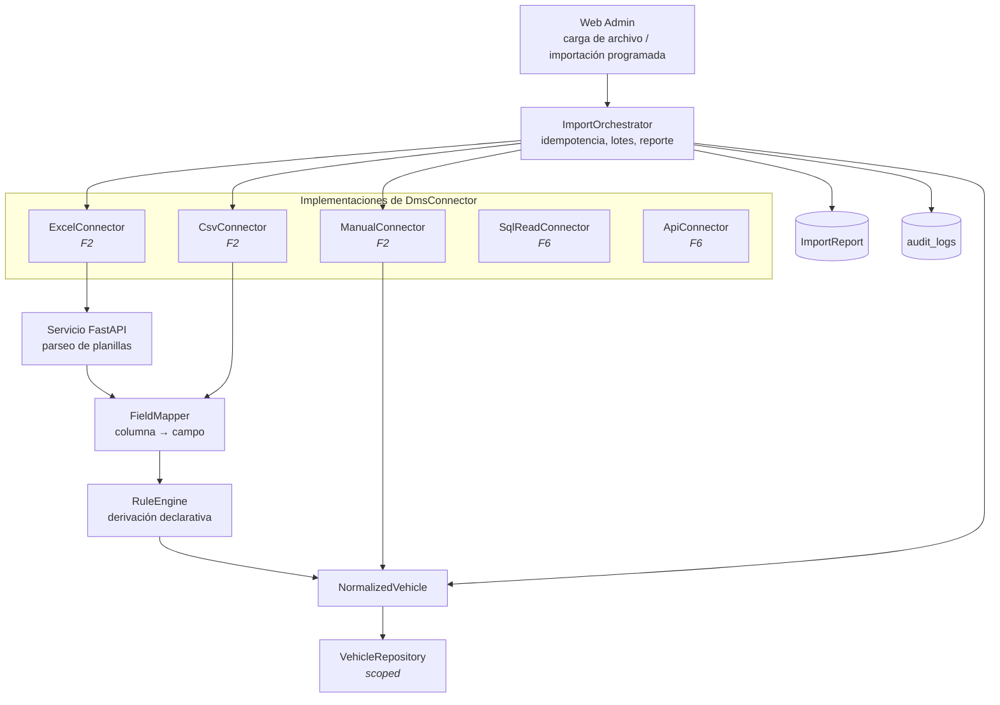

# 03 — Capa de integración `DmsConnector`

**Fase:** 2 · **Requisitos:** REQ-003 · **Cobertura mínima:** 80%

Contrato único de entrada de vehículos. El núcleo del sistema no sabe si un vehículo llegó por
Excel, CSV, carga manual o API. Es la pieza que permite vender al concesionario que no tiene
integración disponible.

---

## 1. Los dos ejes de configuración

El plan original describía la generalización del ETL como «mapeo de columnas configurable por
tenant». Eso resuelve un solo eje. El ETL actual tiene **lógica de negocio de KIA dentro del
parser**, no solo nombres de columnas:

```python
# etl/pipeline.py — reglas actuales, específicas de KIA
ENTREGADO                  → se descarta (no es inventario activo)
FACTURADO                  → POR_ARRIBAR
DEVUELTO                   → CEDIDO
sin factura                → NO_FACTURADO, y se borra la PII del cliente
agencia "MAT"              → sede SURMOTOR
agencia "GRANDA"           → sede GRANDA_CENTENO
teléfono                   → normalización ecuatoriana
```

Otro concesionario tendrá otros nombres de columna **y** otras reglas de derivación. Si solo
se configura el primer eje, el segundo concesionario obliga a tocar código y se rompe la
promesa de onboarding sin desarrollo.

| Eje | Qué varía | Dónde se configura |
|---|---|---|
| **Mapeo de campos** | Nombre y posición de columnas | `tenants/{id}/settings/import-mappings` |
| **Reglas de derivación** | Cómo se deduce el estado, la sucursal, qué filas se descartan | `tenants/{id}/settings/import-rules` |

---

## 2. C4 Nivel 3 — Componentes



---

## 3. Contrato

```typescript
export interface DmsConnector {
  readonly type: 'excel' | 'csv' | 'manual' | 'sql-read' | 'api';

  /** Trae vehículos de la fuente, ya normalizados. */
  fetchVehicles(options: FetchOptions): Promise<NormalizedVehicle[]>;

  /** Valida configuración y conectividad sin efectos secundarios. */
  healthCheck(): Promise<ConnectorHealth>;

  /** Mapeo vigente para este tenant, para mostrar en el admin. */
  getFieldMapping(): FieldMapping;
}

export interface NormalizedVehicle {
  vin: string;                    // clave de deduplicación
  model: string;
  color?: string;
  establishmentCode: string;      // se resuelve a establishmentId
  derivedStatus: VehicleStatus;
  invoiceNumber?: string;
  invoiceDate?: Date;
  client?: NormalizedClient;      // ausente si la regla ordenó descartar PII
  sourceRow: number;              // para el reporte de rechazos
  sourceChecksum: string;
}
```

`sourceRow` es lo que convierte un rechazo en accionable: el reporte dice «fila 47: VIN
inválido», no «hubo 12 errores».

---

## 4. Decisiones de diseño

### D-301 — Motor de reglas declarativo, no plugins de código

Las reglas de derivación se expresan como una lista ordenada de condiciones evaluadas por
prioridad, guardadas como datos:

```json
{
  "statusRules": [
    { "when": { "field": "estado", "equals": "ENTREGADO" }, "action": "SKIP_ROW" },
    { "when": { "field": "estado", "equals": "FACTURADO" }, "then": "POR_ARRIBAR" },
    { "when": { "field": "estado", "equals": "DEVUELTO"  }, "then": "CEDIDO" },
    { "when": { "field": "factura", "isEmpty": true },
      "then": "NO_FACTURADO", "also": ["STRIP_CLIENT_PII"] }
  ],
  "establishmentMap": { "MAT": "surmotor", "GRANDA": "granda-centeno" },
  "normalizers": { "telefono": "EC_PHONE", "vin": "STRIP_LEADING_APOSTROPHE" }
}
```

Deliberadamente **no** es un lenguaje completo. Soporta igualdad, vacío, prefijo y rangos de
fecha. Cuando un cliente necesite algo fuera de eso, se agrega un normalizador con nombre al
catálogo —una función en código, invocable por identificador— en vez de abrir la puerta a
expresiones arbitrarias. Un motor de reglas con lógica libre es una base de código dentro de
la base de datos, sin tests ni revisión.

### D-302 — Idempotencia en dos niveles

| Nivel | Clave | Efecto |
|---|---|---|
| Archivo | `sha256(contenido) + tenantId` | Reimportar el mismo archivo no reprocesa: devuelve el reporte anterior |
| Fila | `(tenantId, vin)` | Upsert. Nunca crea un duplicado de VIN dentro del tenant |

El VIN es único por vehículo a nivel mundial, pero la unicidad se aplica **dentro del tenant**:
dos concesionarios podrían recibir el mismo VIN en una cesión, y son registros distintos con
historias distintas.

### D-303 — Estados protegidos

Un vehículo que ya avanzó en el flujo no puede retroceder porque el Excel del mes trae un valor
viejo. La lista de estados protegidos —que hoy existe como `ETL_PROTECTED_STATUSES` en variable
de entorno— pasa a configuración por tenant.

Si una fila intenta pisar un estado protegido, no se aplica y se registra en el reporte como
rechazo con motivo `PROTECTED_STATUS`. Se informa, no se silencia.

### D-304 — El reporte de importación es una entidad, no un log

```typescript
interface ImportReport {
  id: string;
  tenantId: string;
  connectorType: string;
  fileName?: string;
  fileChecksum: string;
  startedAt: Date;
  finishedAt: Date;
  created: number;
  updated: number;
  skipped: number;
  rejected: RejectedRow[];   // { row, vin?, reason, rawValue }
  executedBy: string;
}
```

Se persiste, se muestra en el admin y se audita. Es evidencia frente al cliente cuando
pregunta por qué faltan tres autos.

### D-305 — Límites operativos

| Límite | Valor | Motivo |
|---|---|---|
| Tamaño de archivo | 10 MB | Ya vigente en el ETL |
| Filas por importación | 5.000 | Cota superior conocida antes de necesitar procesamiento asíncrono |
| Escrituras por lote | 500 | Límite de `batch` de Firestore |
| Tiempo máximo síncrono | 60 s | Por encima, la importación pasa a job en background con notificación |

---

## 5. Estrategia de pruebas

### Unitarios — 80% mínimo

| Caso | Qué verifica |
|---|---|
| `RuleEngine` con reglas en conflicto | Gana la primera por orden de prioridad |
| `RuleEngine` sin regla coincidente | Estado por defecto, sin excepción |
| `SKIP_ROW` | La fila no llega a `NormalizedVehicle` |
| `STRIP_CLIENT_PII` | El resultado no contiene datos del cliente |
| `FieldMapper` con columna faltante | Rechazo con motivo, no excepción no controlada |
| Normalizador de VIN | Quita el apóstrofo inicial de Excel |
| Normalizador de teléfono ecuatoriano | Casos válidos, inválidos y con prefijo internacional |
| Resolución de `establishmentCode` desconocido | Rechazo `UNKNOWN_ESTABLISHMENT` |

### Integración — emulador y archivos reales anonimizados

| Caso | Qué verifica |
|---|---|
| Importar el mismo archivo dos veces | Segunda ejecución: 0 creados, 0 actualizados |
| Importar dos formatos distintos con mapeos distintos | Ambos producen `NormalizedVehicle` equivalentes |
| Importar mientras un vehículo está en estado protegido | No se pisa; queda en `rejected` |
| Importar bajo el tenant A | Ningún documento del tenant B se modifica |
| Archivo de 5.000 filas | Termina dentro del presupuesto de tiempo y lotes |

Los archivos de prueba viven en `test/fixtures/imports/` con datos anonimizados: VIN sintéticos
válidos según ISO 3779 y cédulas ecuatorianas que pasan el validador de dígito verificador pero
no corresponden a personas reales.

### BDD — `backend/features/importacion-dms.feature`

Cubre REQ-003, con al menos dos formatos distintos.
