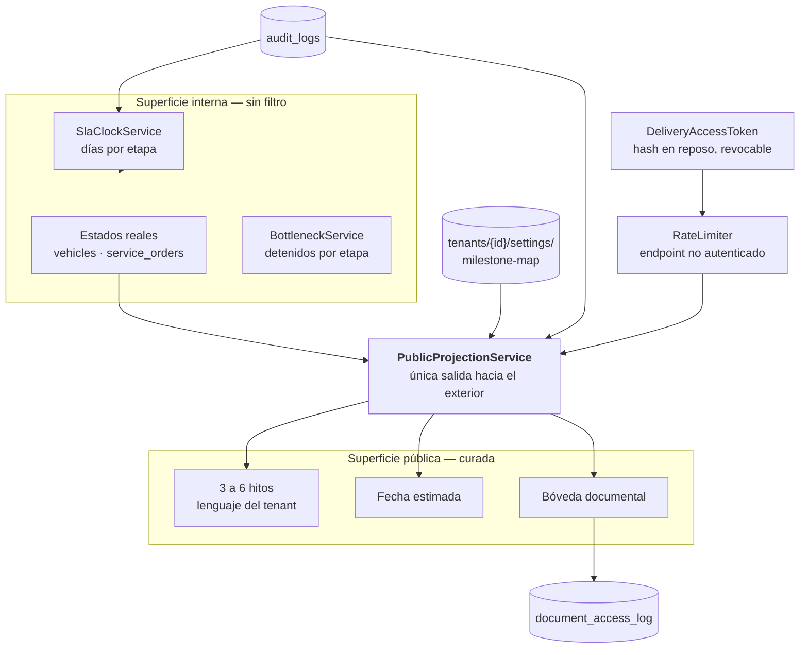

# 04 — Proyección pública y bóveda documental

**Fase:** 0 (bóveda) y 3 (proyección) · **Requisitos:** REQ-014, REQ-015 · **Cobertura mínima:** 90%

La única salida de datos hacia el cliente final del concesionario. Traduce estados internos a
hitos curados, publica una fecha estimada y custodia los documentos de la entrega.

---

## 1. Por qué existe este módulo

Quien compra el sistema es el gerente del concesionario. Quien usa esta superficie es el
comprador del vehículo, que no paga nada. Sus intereses no coinciden.

Si un vehículo lleva doce días detenido en documentación porque falta subir una cédula, y el
cliente lo ve en tiempo real, eso no genera calma: genera llamadas al asesor y expone la
ineficiencia interna del concesionario ante su propio cliente. Ningún gerente compra una
herramienta que hace eso.

**El valor real no es transparencia.** Es que el asesor deje de contestar «¿cómo va mi carro?»
por WhatsApp. Esa es la métrica que el gerente entiende: horas-hombre recuperadas.

Y lo que elimina esa consulta no es un estado, es **una fecha**. El cliente nunca quiso saber
dónde está su auto; quiso saber cuándo lo tiene.

### D-401 — Dos superficies, una frontera con nombre

| | Superficie interna | Superficie pública |
|---|---|---|
| Consume | Gerente, asesor, taller | Cliente final |
| Autenticación | Firebase Auth + roles | Token opaco por entrega |
| Contenido | Estados crudos, relojes de SLA, cuellos de botella | 3 a 6 hitos, fecha estimada, documentos |
| Regla | La crudeza es el producto | Nada feo, nunca |

No es un portal con filtros. Son dos superficies con audiencias opuestas. Implementarlo como un
único servicio con un flag `esPublico` es la forma exacta en que un estado interno termina
visible en producción.

---

## 2. C4 Nivel 3 — La frontera de curaduría



`PublicProjectionService` es el único componente con permiso de servir datos al exterior. El
controlador público **no inyecta ningún repositorio**; solo este servicio. Es una restricción
verificable con test de arquitectura.

---

## 3. Decisiones de diseño

### D-402 — El mapa de hitos es una tabla de lookup, no una máquina de estados

Distinción importante para no repetir un error que ya identificamos: volver configurable la
*máquina de estados interna* significa reescribir el núcleo del negocio, porque las transiciones,
los permisos por rol y los disparadores de notificación están acoplados a `VehicleStatus` en
cinco módulos.

Esto es otra cosa. Es una proyección de muchos a pocos, sin lógica:

```json
{
  "milestones": [
    { "key": "recibido",    "label": "Recibimos tu vehículo",
      "internalStates": ["POR_ARRIBAR", "ENVIADO_A_MATRICULAR", "MATRICULADO"] },
    { "key": "preparacion", "label": "Estamos preparando tu vehículo",
      "internalStates": ["CERTIFICADO", "DOCUMENTADO", "OT_GENERADA", "EN_INSTALACION"] },
    { "key": "listo",       "label": "Tu vehículo está listo",
      "internalStates": ["LISTO_PARA_ENTREGA", "AGENDADO"] },
    { "key": "entregado",   "label": "Entregado",
      "internalStates": ["ENTREGADO"] }
  ]
}
```

Cuatro hitos absorben once estados internos. Un retraso dentro de «preparación» es invisible
para el cliente: el hito no cambia, y eso es exactamente lo que el gerente compra.

Es barato de construir, barato de testear y no toca el núcleo.

### D-403 — La fecha estimada es el producto, el hito es el acompañamiento

```typescript
interface PublicDeliveryView {
  vehicle: { model: string; color?: string; plate?: string };
  currentMilestone: { key: string; label: string; index: number; total: number };
  estimatedDelivery: {
    date: string;          // ISO, solo día
    confidence: 'confirmed' | 'estimated';
  };
  documents: PublicDocument[];
  dealerContact: { name: string; phone: string };
}
```

Reglas de la fecha:

- Cuando hay cita agendada, `confidence: 'confirmed'` y la fecha es la de la cita.
- Antes de eso, se calcula sumando la duración mediana de las etapas restantes, medida sobre
  el histórico **de ese tenant**. Un concesionario lento verá su propia realidad.
- **La fecha nunca retrocede visiblemente.** Si el recálculo da más tarde, se actualiza; si
  el cliente ya vio una fecha, la nueva se comunica por notificación proactiva con el motivo
  que el asesor cargue, no como un cambio silencioso que el cliente descubre.
- Nunca se muestra «atrasado», «demorado», «pendiente» ni ningún término que implique falla.

### D-404 — Prueba dorada: el payload público no contiene vocabulario interno

Barata, y es la que evita el peor incidente posible de este módulo.

```typescript
it('nunca expone vocabulario interno en la respuesta pública', () => {
  const payload = JSON.stringify(await projection.build(vehicleId));
  const prohibidos = [
    ...Object.values(VehicleStatus),
    ...Object.values(RoleEnum),
    'tenantId', 'establishmentId', 'internalNotes', 'assignedTechnician',
    'slaBreached', 'daysInStage',
  ];
  for (const termino of prohibidos) {
    expect(payload).not.toContain(termino);
  }
});
```

Se ejecuta contra **todos** los estados internos posibles, no contra uno. Un `describe.each`
sobre `Object.values(VehicleStatus)` cuesta nada y cubre el espacio completo.

### D-405 — Tokens: hash en reposo, como una contraseña

El endpoint público no está autenticado. El token *es* la credencial.

```typescript
interface DeliveryAccessToken {
  id: string;
  tenantId: string;
  vehicleId: string;
  tokenHash: string;        // sha256 del token; el token en claro nunca se guarda
  createdAt: Date;
  revokedAt?: Date;
  lastAccessedAt?: Date;
  accessCount: number;
}
```

- 32 bytes aleatorios criptográficamente seguros, codificados en base64url.
- Se guarda el hash. Si la base se filtra, los tokens no sirven.
- Revocable por el concesionario desde el admin.
- **No expira tras la entrega.** El valor de la bóveda es la permanencia: el cliente vuelve a
  los tres años por garantía o reventa. Expirar el acceso destruye el argumento principal.
- La búsqueda por token es por hash con índice, no por escaneo.

### D-406 — Límite de tasa obligatorio

Endpoint no autenticado y adivinable por fuerza bruta si no se protege. `@nestjs/throttler`
con límite por IP y por token. Un token que recibe cien peticiones en un minuto se marca para
revisión.

Esto no estaba en el plan original y es un requisito de seguridad, no una optimización.

### D-407 — La bóveda documental tiene argumento legal, no de comodidad

Vender la bóveda como «no se te pierde el WhatsApp» la deja como una mejora menor. El argumento
fuerte es otro:

- Acta generada server-side con `pdfkit` —ya presente en el backend—, numerada.
- `sha256` del contenido almacenado junto al documento: se puede demostrar que el PDF de hoy es
  bit a bit el que se firmó.
- **Registro de acceso**: quién descargó, cuándo, desde qué IP.

Cuando el cliente vuelve a los ocho meses diciendo «el vehículo no vino con eso», el
concesionario tiene evidencia íntegra y con trazabilidad de entrega. Un DMS que manda documentos
por correo no tiene nada de eso.

Sumado a la LOPDP, la bóveda deja de ser una comodidad y pasa a ser un activo de cumplimiento
que se le vende al gerente y al abogado.

### D-408 — Instrumento de línea base

Para vender «tu asesor recupera X horas por semana» hay que poder medirlo, y hoy nadie sabe
cuántas consultas de estado recibe un asesor.

Un botón de un toque en la app móvil —«registrar consulta de cliente»— que escribe un evento
con vehículo, canal y marca de tiempo. Se construye en un día.

Existe con un único propósito: generar la evidencia del ROI del propio producto. Sin medición
previa al piloto, en el mes tres la única respuesta al «¿cuánto mejoró?» es una anécdota, y
ahí se pierde la renovación.

---

## 4. Estrategia de pruebas

### Unitarios — 90% mínimo

| Caso | Qué verifica |
|---|---|
| Prueba dorada sobre **todos** los `VehicleStatus` | Ningún término interno se filtra — REQ-014 |
| Estado interno sin hito mapeado | Cae al hito anterior conocido; nunca lanza ni muestra el estado crudo |
| Cálculo de fecha con cita agendada | `confidence: 'confirmed'` |
| Cálculo de fecha sin cita | Usa medianas del tenant, no globales |
| Vehículo de otro tenant vía token válido | Devuelve 404 |
| Token revocado | 404, no 403 |
| Token inexistente | 404, mismo tiempo de respuesta que uno válido *(sin canal lateral)* |
| Verificación de hash de documento | Detecta alteración de un byte |

### Integración — emulador

| Caso | Qué verifica |
|---|---|
| Recorrido completo por los estados internos | El hito público avanza solo cuando corresponde |
| Descarga de documento | Escribe entrada en `document_access_log` |
| Límite de tasa superado | Devuelve 429 y marca el token |

### Arquitectura

Test que falla si `PublicController` inyecta cualquier repositorio distinto de
`PublicProjectionService`. Es la garantía estructural de la frontera.

### BDD — `backend/features/proyeccion-publica.feature`

Cubre REQ-014 y REQ-015.
