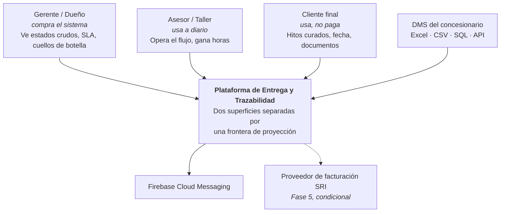
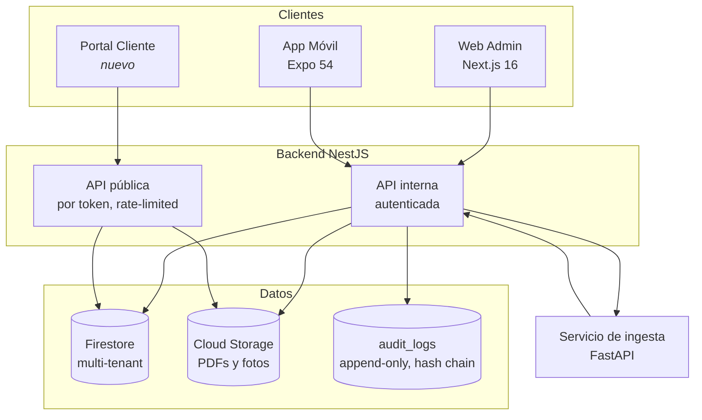

# Diseño técnico — Plataforma de Entrega y Trazabilidad

Diseño de los módulos nuevos necesarios para convertir el sistema mono-tenant actual
en un producto SaaS vendible a múltiples concesionarios.

Este documento es el índice y la vista general. Cada módulo tiene su propio documento
con contrato, decisiones de diseño, diagramas C4 y estrategia de pruebas.

| # | Documento | Módulo | Fase |
|---|---|---|---|
| 01 | [Multi-tenancy](01-multi-tenancy.md) | `TenantContext`, `TenantGuard`, `TenantScopedRepository` | F1 |
| 02 | [Auditoría inmutable](02-auditoria.md) | `AuditModule` | F1 |
| 03 | [Capa de integración](03-dms-connector.md) | `DmsConnector` y sus implementaciones | F2 |
| 04 | [Proyección pública](04-proyeccion-publica.md) | `PublicProjectionService`, bóveda documental | F0 / F3 |
| 05 | [Estrategia de pruebas](05-estrategia-de-pruebas.md) | Pirámide, umbrales, CI | Transversal |
| 06 | [Runbook de migración](06-runbook-migracion.md) | Procedimiento operativo paso a paso | F1 |

---

## 1. Estado de partida (verificado sobre el código)

Estos hechos se verificaron leyendo el repositorio, no la documentación previa.
Varios contradicen lo que dicen los documentos existentes en `web/docs/`.

| Hecho | Evidencia | Impacto en el diseño |
|---|---|---|
| No existe capa de repositorio | 165 llamadas `.collection()` directas en 14 services; 39 en `vehicles.service.ts` | `TenantScopedRepository` es construcción, no refactor |
| `SedeEnum` está en el custom claim de auth | `common/guards/firebase-auth.guard.ts`, `AuthenticatedUser` | El enum debe morir; multi-tenant exige establecimientos por tenant |
| Scoping por `sede` aplicado a mano e inconsistente | ~10 sitios; a veces desde `user.sede`, a veces desde query param | La convención no alcanza; hace falta enforcement automatizado |
| 8 rutas leen colecciones completas y filtran en memoria | `vehicles.service.ts`, `service-orders.service.ts`, `users.service.ts` | Riesgo de costo y de vecino ruidoso en modelo pooled |
| No hay Firebase Emulator configurado | `firebase.json` solo declara `indexes` | La capa de integración de la pirámide hoy es 0% |
| **No existe ningún `firestore.rules` en el repositorio** | Búsqueda en todo el árbol: sin resultados | El aislamiento no está versionado ni es testeable |
| Sin `coverageThreshold` en Jest | `package.json` → bloque `jest` | No hay puerta de CI por cobertura |
| 11 specs unitarios, 1 e2e, 0 integración | `rg --files -g '*.spec.ts'` | Módulos sin ningún test: appointments, catalogs, delivery, home, seed, users |

### Hallazgo crítico

El repositorio **no contiene un archivo de reglas de Firestore**. La afirmación de que el
acceso directo del cliente está bloqueado no está en control de versiones, no se revisa en
pull request y no se puede probar. Para un producto cuyo argumento de venta es el aislamiento
de datos entre concesionarios, esto se corrige en la Fase 0: las reglas se versionan y se
prueban con `@firebase/rules-unit-testing` contra el emulador.

---

## 2. Principios de diseño

1. **El `tenantId` nunca viene del cliente.** Se extrae del token verificado y pisa cualquier
   valor presente en body, query o parámetros de ruta.
2. **Imposible por construcción, no por convención.** Todo invariante crítico se hace cumplir
   por tipos, por lint en CI o por excepción en tiempo de ejecución. Nunca por revisión de código.
3. **Fallar cerrado.** Ausencia de contexto de tenant es una excepción, no una consulta sin filtro.
4. **404 antes que 403 en accesos cruzados.** Un 403 confirma que el recurso existe en otro tenant.
   Eso es enumeración. Ver [decisión D-104](01-multi-tenancy.md#d-104).
5. **Superficie interna y superficie pública son dos productos distintos.** La frontera entre
   ambas es un componente con nombre, no un flag de configuración.
6. **Tamper-evident donde tamper-proof es imposible.** El Admin SDK ignora las reglas de Firestore.
   La inmutabilidad de auditoría se logra con cadena de hash, no con reglas. Ver [D-201](02-auditoria.md#d-201).

---

## 3. C4 Nivel 1 — Contexto



La asimetría es deliberada: quien firma el contrato ve todo sin filtro; quien usa la superficie
pública ve una proyección curada. Diseñar una sola superficie configurable con un flag es cómo
se filtra un estado interno a producción.

---

## 4. C4 Nivel 2 — Contenedores



**Decisión estructural:** la API pública es un contenedor lógico separado, con su propio
controlador, su propio guard y sin acceso a los repositorios internos. Su única fuente de datos
es `PublicProjectionService`. Ver [documento 04](04-proyeccion-publica.md).

---

## 5. Matriz de módulos nuevos

| Módulo | Fase | C4 propio | BDD obligatorio | Cobertura mínima | Riesgo si falla |
|---|---|---|---|---|---|
| `TenantContext` + `TenantGuard` | F1 | Sí | Sí — REQ-001 | 90% | Fatal: legal y reputacional |
| `TenantScopedRepository` | F1 | Sí | Sí — REQ-001 | 90% | Fatal: filtración entre tenants |
| `AuditModule` | F1 | Sí | Sí — REQ-002 | 85% | Alto: pérdida de trazabilidad vendida |
| `DmsConnector` + implementaciones | F2 | Sí | Sí — REQ-003 | 80% | Medio: datos corruptos, duplicados |
| `PublicProjectionService` | F3 | Sí | Sí — REQ-014 | 90% | Alto: expone estado interno al cliente |
| Bóveda documental | F0 | No | Sí — REQ-015 | 85% | Medio: pérdida de valor legal |
| `EInvoiceProvider` (SRI) | F5 | Sí | Sí — REQ-005 | 85% | Fatal: infracción tributaria |

---

## 6. Trazabilidad de requisitos

Cada requisito tiene un identificador estable que aparece como tag en los archivos `.feature`
de `backend/features/`. La suite de Cucumber se puede filtrar por tag para correr solo lo crítico
en cada pull request.

| ID | Requisito | Feature |
|---|---|---|
| REQ-001 | Ningún tenant puede leer ni escribir datos de otro tenant | `aislamiento-tenant.feature` |
| REQ-002 | Todo cambio de estado de negocio queda auditado y es inmutable | `auditoria-inmutable.feature` |
| REQ-003 | La importación es idempotente y reporta rechazos con motivo | `importacion-dms.feature` |
| REQ-004 | El `tenantId` del token prevalece sobre el del payload | `aislamiento-tenant.feature` |
| REQ-014 | La superficie pública nunca expone un estado interno crudo | `proyeccion-publica.feature` |
| REQ-015 | El acta entregada es íntegra, permanente y su acceso queda registrado | `proyeccion-publica.feature` |
| REQ-020 | La segregación de funciones se hace cumplir por acción, no por pantalla | `aislamiento-tenant.feature` |

---

## 7. Orden de implementación y por qué

```
F0  Reglas versionadas + emulador + bóveda documental
     └─ habilita testear aislamiento antes de construirlo

F1  TenantContext → TenantScopedRepository → migración → AuditModule
     └─ todo lo demás asume que el scoping es correcto

F2  DmsConnector
     └─ necesita repositorios con scope para no cruzar datos al importar

F3  PublicProjectionService
     └─ necesita audit_logs (timeline) y scoping (no proyectar de otro tenant)

F5  Facturación
     └─ necesita auditoría y segregación de funciones ya probadas
```

El orden no es negociable en un punto: **la suite de aislamiento debe existir y estar verde
antes de que se escriba la primera línea de `PublicProjectionService`**. Una proyección pública
sobre un scoping no probado es la combinación exacta que expone datos de un concesionario a
un cliente de otro.
